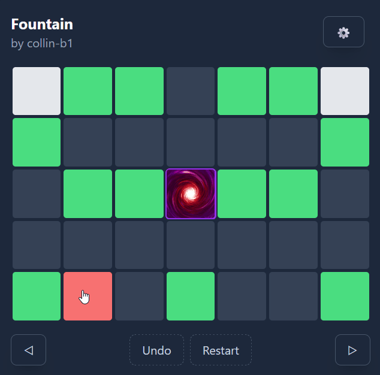

# [Synergy](https://collinb.me/synergy)

<div style="text-align:center;">
  
  <p>Synergy is a tile-moving puzzle game.</p>
</div>

# How to Play

The goal of the game is to move the player onto the portal tile. This may be achieved by **moving tiles** on the board until a path is made to the goal.

## Movement Rules

Each tile has specific movement rules:

- **Obstacles** and **The Player** are solid, may move in any of the cardinal directions, and must continue to move until stopped by a another tile.

- **Sticky Tiles** are semisolid and immovable, and create a destination for movable tiles to stop at. Additionally, movable tiles may choose to continue moving through the sticky tile.

- **Powered Tiles** are solid, and may only move if directly adjacent to the player.

- **Walls** are immovable solid tiles. This tile does not appear in official levels but is available for use in the level editor.

Movements can be undone by pressing the "Undo" button. To see how a tile may be moved, select it and look for the circular destination markers which may appear.

## Win Condition

To trigger a win, the player must end their movement directly on top of the goal. The player may move over the goal, but it will not count for a win. Other movable objects may also land on the goal, but will not trigger a win.

## Hard Mode

Hard mode can be toggled in the settings menu, and changes the following properties:

- Destination markers are disabled
- Undo is disabled
- Level skipping without completion is disabled
- Powered tiles no longer indicate state

# User Levels

Included in the game is a level editor which can be utilized to create and share levels. The level being created is automatically encoded in the link under the "Share" section.

# Development

## Getting started

1. Clone the repository

```sh
$ git clone https://github.com/collin-b1/synergy.git
$ cd synergy
```

2. Install dependencies

```sh
$ npm install
```

3. Run developer environment

```sh
$ npm run dev
```

## Adding new levels

To add a new level to the base game, "Export" the level from the level editor and add it to the levels array in `src/api/index.ts` (this is subject to change).
